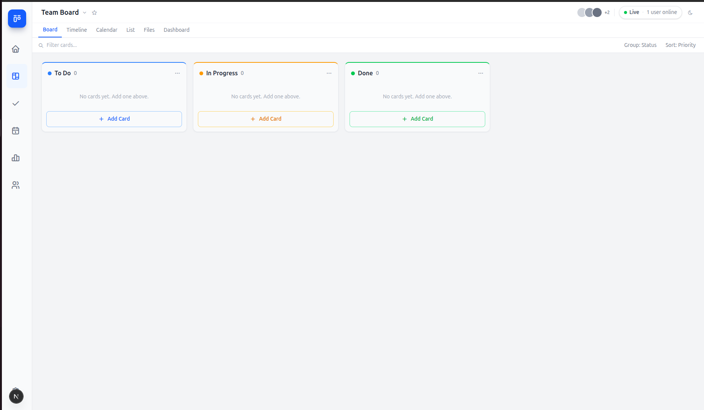
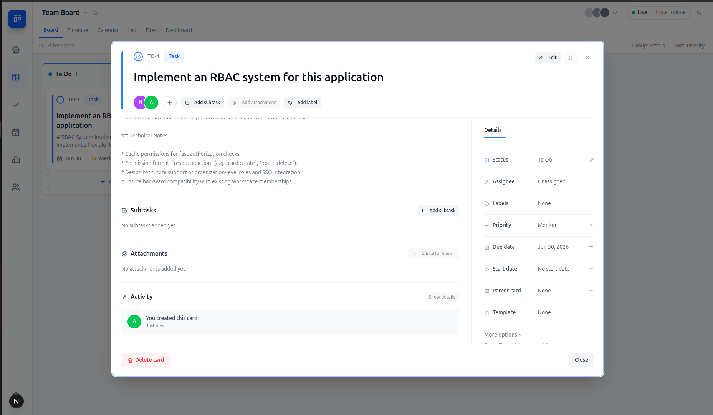

# Team Kanban

A real-time collaborative Kanban board built with Next.js, Supabase, and TypeScript.

**Next.js 16** | **React 19** | **TypeScript** | **Tailwind CSS 4** | **Supabase** | **Vercel**

---

## Screenshots




> Screenshots are from the development environment running locally.

---

## Features

- Real-time board sync across multiple users (Supabase Realtime)
- Live presence indicator showing connected user count
- Drag and drop cards between columns with optimistic updates
- Three-mode card editor: create, view, and edit
- Subtasks support per card
- Priority levels, labels, and due dates on cards
- Collapsible sidebar navigation
- Dark / light mode toggle
- Skeleton loading states on initial board load
- Inline card creation loading state
- Real-time search across card titles, descriptions, and labels
- Responsive layout from tablet to 4K

---

## Tech Stack

| Layer | Technology |
|---|---|
| Framework | Next.js 16.2 (App Router) |
| Language | TypeScript (strict mode) |
| Styling | Tailwind CSS v4 |
| Database | Supabase (PostgreSQL) |
| Realtime | Supabase Realtime + Presence |
| Monorepo | Turborepo + pnpm workspaces |
| Deployment | Vercel |

---

## Architecture

The project is a Turborepo monorepo with one application (`apps/web`) and a shared types package (`packages/types`). All TypeScript interfaces — `Column`, `Card`, `Priority`, and the `Database` schema type — live in `packages/types` and are consumed by the web app.

Inside the app, concerns are layered: service files handle raw Supabase calls, `useBoard` and `usePresence` wrap those calls in React state and subscriptions, and components only talk to hooks - never to the service layer directly. This keeps data-fetching logic easy to test and replace independently of the UI.

---

## Getting Started

Follow these steps in order. If one command fails, stop there and fix it before moving to the next step.

### What you need first

Install these once on your computer:

1. **Node.js 22.13 or newer**

   Check your version:

   ```bash
   node -v
   ```

2. **pnpm 11**

   If `pnpm -v` does not work, install pnpm with Corepack:

   ```bash
   corepack enable
   corepack prepare pnpm@11.9.0 --activate
   pnpm -v
   ```

3. **Supabase CLI**

   If `supabase -v` does not work, install the Supabase CLI:

   ```bash
   npm install -g supabase
   supabase -v
   ```

4. **A Supabase account and project**

   Create a free project at [supabase.com](https://supabase.com). Keep the dashboard open because you will copy values from it in the next steps.

### 1. Install project packages

```bash
pnpm install
```

This installs the web app dependencies, shared workspace packages, and tooling used by Turborepo.

### 2. Create the local environment file

```bash
cp apps/web/.env.example apps/web/.env.local
```

Open `apps/web/.env.local` and fill in these two values:

- `NEXT_PUBLIC_SUPABASE_URL`
- `NEXT_PUBLIC_SUPABASE_ANON_KEY`

Find them in **Supabase Dashboard -> Project Settings -> API**.

Your file should look like this:

```bash
NEXT_PUBLIC_SUPABASE_URL=https://your-project-ref.supabase.co
NEXT_PUBLIC_SUPABASE_ANON_KEY=your-anon-key
```

Do not commit `.env.local`. It is only for your computer.

### 3. Link Supabase and apply migrations

Log in to Supabase from the terminal:

```bash
supabase login
```

Find your project ref in the Supabase Dashboard URL:

```text
https://supabase.com/dashboard/project/<PROJECT_REF>
```

Link this repository to your Supabase project:

```bash
supabase link --project-ref <PROJECT_REF>
```

This stores the project link locally so future database commands know which Supabase project to use.

Now create the database tables, policies, Realtime setup, and default columns:

```bash
pnpm db:push
```

This runs the SQL files in `supabase/migrations`. After this step, Supabase has the `columns` and `cards` tables that the app reads from.

### 4. Run the app

```bash
pnpm dev
```

Open [http://localhost:3000](http://localhost:3000).

If the board loads, setup worked. If it does not, check that `.env.local` has the correct Supabase URL and anon key, then restart `pnpm dev`.

### Setup Checklist

- `node -v` shows version `22.13` or newer.
- `pnpm -v` works.
- `supabase -v` works.
- `apps/web/.env.local` contains your Supabase URL and anon key.
- `pnpm db:push` finishes without errors.
- `pnpm dev` starts the local app.

### Quick Setup Command List

Use this only after you understand the steps above:

```bash
pnpm install
cp apps/web/.env.example apps/web/.env.local
supabase login
supabase link --project-ref <PROJECT_REF>
pnpm db:push
pnpm dev
```

#### Useful Supabase Docs

- [Supabase docs](https://supabase.com/docs)
- [Creating a new project](https://supabase.com/docs/guides/getting-started)
- [API URL and anon key](https://supabase.com/docs/guides/api/api-keys)
- [Enabling Realtime on tables](https://supabase.com/docs/guides/realtime/postgres-changes)
- [Row Level Security basics](https://supabase.com/docs/guides/auth/row-level-security)

### Useful database commands

```bash
pnpm db:push
pnpm db:reset
pnpm db:types
```

- `pnpm db:push` applies local migrations to the linked Supabase project.
- `pnpm db:reset` resets a local Supabase database from migrations. This requires Docker and a local `supabase start` workflow.
- `pnpm db:types` regenerates Supabase database types from the linked project into `packages/types/src/database.types.ts`. Review the generated output before replacing the hand-curated shared types in `packages/types/src/index.ts`.

New schema changes should be added as timestamped SQL files in `supabase/migrations`. Do not edit migrations that have already been pushed to a shared Supabase project; create a new migration instead.

---

## Deployment (Vercel)

1. Push the repository to GitHub
2. Import the repo in [Vercel](https://vercel.com)
3. Set the **Root Directory** to `apps/web`
4. Add environment variables:
   - `NEXT_PUBLIC_SUPABASE_URL`
   - `NEXT_PUBLIC_SUPABASE_ANON_KEY`
5. Deploy

---

## Project Structure

```
kanban-board/
├── apps/
│   └── web/                    # Next.js application
│       └── src/
│           ├── app/            # App Router pages and layout
│           ├── components/
│           │   ├── atoms/      # Button, Badge, Spinner, Dot
│           │   ├── molecules/  # ConnectionBadge, Modal, FormField
│           │   └── organisms/  # KanbanBoard, KanbanColumn, KanbanCard
│           ├── hooks/          # useBoard, usePresence
│           ├── services/       # Supabase service layer
│           ├── types/          # Local TypeScript types
│           └── constants/      # App-wide string constants
├── packages/
│   └── types/                  # Shared app and database types
└── supabase/
    ├── config.toml             # Supabase CLI project config
    └── migrations/             # Reproducible database schema
```

---

## How Realtime Works

Both the `columns` and `cards` tables have Supabase Realtime enabled via `supabase_realtime` publication. `useBoard` subscribes to `INSERT`, `UPDATE`, and `DELETE` events on both tables — any change made by one user is immediately pushed to every connected client, which triggers a board refresh. `usePresence` uses a separate Supabase Presence channel: each browser session calls `channel.track()` on connect and the presence state is synced on `join`, `leave`, and `sync` events. The connection badge reflects live status and the exact count of active users in real time.

---

## Trade-offs and What I'd Improve

### Trade-offs made

- **No authentication** — The board is public-access for simplicity. Adding Supabase Auth would take ~2 hours but was out of scope.
- **Single board** — The app manages one shared board. Multi-board support would require a `boards` table and routing per board.
- **Order on move** — Cards dropped into a column always append to the bottom. True position-aware reordering would need fractional indexing (e.g. lexicographic ordering).
- **No conflict resolution** — If two users edit the same card simultaneously, last write wins. Proper CRDT-based merging is complex and out of scope.
- **Client-side search** — Search filters already-loaded cards in memory. For large boards, server-side full-text search with Postgres `tsvector` would scale better.

### What I'd add with more time

- User authentication and per-user boards
- Multiple boards with a dashboard view
- Card comments and activity log
- File attachments via Supabase Storage
- Keyboard shortcuts (j/k navigation, `n` for new card)
- Unit tests for the service layer (Jest)
- Integration tests for board interactions (React Testing Library + MSW)
- End-to-end tests (Playwright)
- Position-aware drag and drop with fractional ordering
- Mobile-first drag and drop (touch events)
- Card archiving instead of hard delete
